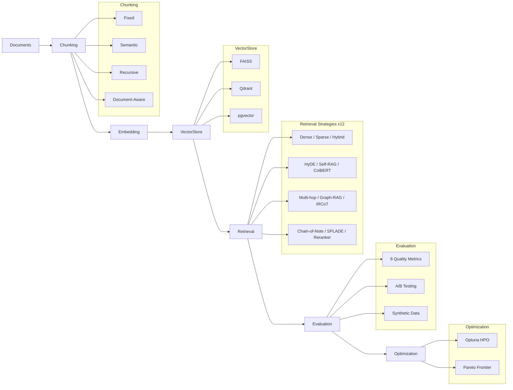

<div align="center">

# Spectra

**Benchmark, compare, and optimize RAG pipelines with rigorous statistical testing.**

[](https://www.python.org/downloads/)
[](https://github.com/facebookresearch/faiss)
[](https://optuna.org/)
[](LICENSE)
[](https://github.com/JiwaniZakir/spectra/stargazers)
[](https://github.com/JiwaniZakir/spectra/network/members)

<br/>

[Quick Start](#-quick-start) &nbsp;&bull;&nbsp; [Features](#-features) &nbsp;&bull;&nbsp; [Architecture](#-architecture) &nbsp;&bull;&nbsp; [Benchmarks](#-benchmarks) &nbsp;&bull;&nbsp; [Contributing](#-contributing)

</div>

<br/>

## Overview

Spectra is a systematic RAG evaluation toolkit that implements **12 retrieval strategies** spanning dense, sparse, hybrid, generative, iterative, and graph-based approaches. It provides automated A/B testing with statistical rigor (Welch's t-test, Mann-Whitney U, bootstrap), 8 quality metrics aligned with the RAGAS framework, and Pareto-optimal pipeline selection powered by Optuna -- everything needed to move from prototype to production RAG.

<br/>

## :sparkles: Features

- **12 Retrieval Strategies** -- Dense, BM25, SPLADE, Hybrid RRF, HyDE, Self-RAG, ColBERT, Multi-hop, Graph-RAG, IRCoT, Chain-of-Note, Cross-encoder Reranker
- **8 Evaluation Metrics** -- Faithfulness, Answer Relevance, Context Relevance, Coherence, Context Recall, Context Precision, Answer Correctness, Latency Score
- **Statistical A/B Testing** -- Welch's t-test, Mann-Whitney U, paired t-test, bootstrap permutation with Bonferroni correction
- **Optuna-Powered Optimization** -- Automated hyperparameter search across chunking, embedding, retrieval, and re-ranking stages
- **Pareto Frontier Analysis** -- Multi-objective selection with NSGA-II crowding distance for quality vs. latency trade-offs
- **4 Chunking Strategies** -- Fixed, Semantic, Recursive, and Document-Aware splitting
- **3 Vector Store Backends** -- FAISS, Qdrant, pgvector
- **Streamlit Dashboard** -- Interactive visualization of metrics, comparisons, and optimization results
- **Synthetic Data Generation** -- Automatic evaluation dataset creation for rapid iteration

<br/>

## :building_construction: Architecture



<br/>

## :wrench: Tech Stack

<div align="center">

[](https://python.org)
[](https://docs.pydantic.dev/)
[](https://numpy.org)
[](https://scikit-learn.org)
[](https://scipy.org)
[](https://github.com/facebookresearch/faiss)
[](https://optuna.org)
[](https://streamlit.io)

</div>

<br/>

## :rocket: Quick Start

### Installation

```bash
# Core
pip install spectra-rag

# With all vector store backends + dashboard
pip install spectra-rag[all]

# Development
pip install spectra-rag[dev]
```

### Build a Pipeline

```python
from spectra.retrieval.base import Document
from spectra.retrieval.dense import DenseRetriever
from spectra.optimization.pipeline import RAGPipeline, PipelineConfig

docs = [
    Document(id="1", content="RAG combines retrieval with generation..."),
    Document(id="2", content="Dense retrieval uses learned embeddings..."),
]

pipeline = RAGPipeline(
    DenseRetriever(),
    PipelineConfig(chunk_size=256, top_k=3),
)
pipeline.ingest(docs)

result = pipeline.query("What is RAG?")
for doc, score in zip(result.retrieved_documents, result.scores):
    print(f"[{score:.3f}] {doc.content[:80]}...")
```

### Evaluate Quality

```python
from spectra.evaluation.metrics import EvaluationSample, compute_all_metrics

sample = EvaluationSample(
    query="What is RAG?",
    answer=result.retrieved_documents[0].content,
    contexts=[d.content for d in result.retrieved_documents],
    ground_truth="RAG combines retrieval with generation.",
    latency_seconds=result.latency_seconds,
)
metrics = compute_all_metrics([sample])
print(metrics.scores)
```

### A/B Test Strategies

```python
from spectra.evaluation.ab_testing import ABTest, ABTestConfig

ab = ABTest(ABTestConfig(significance_level=0.05))
results = ab.compare(samples_dense, samples_hybrid, "Dense", "Hybrid")

for r in results:
    print(f"{r.metric}: p={r.p_value:.4f}, winner={r.winner}")
```

### Optimize with Optuna

```python
from spectra.optimization.optimizer import PipelineOptimizer, OptimizerConfig

optimizer = PipelineOptimizer(
    documents=docs,
    eval_queries=queries,
    eval_ground_truths=ground_truths,
    config=OptimizerConfig(n_trials=100),
)
result = optimizer.optimize()
print(f"Best config: {result.best_config}")
print(f"Best score:  {result.best_score:.4f}")
```

### Launch Dashboard

```bash
spectra
# or
streamlit run src/spectra/dashboard/app.py
```

<br/>

## :dart: Retrieval Strategies

| # | Strategy | Type | Key Idea | Reference |
|---|----------|------|----------|-----------|
| 1 | **Dense (Bi-encoder)** | Dense | Embed query & docs into shared vector space | Karpukhin et al., 2020 |
| 2 | **BM25** | Sparse | Classic TF-IDF lexical matching | Robertson & Zaragoza, 2009 |
| 3 | **SPLADE** | Sparse | Learned sparse representations via MLM | Formal et al., 2021 |
| 4 | **Hybrid (RRF)** | Hybrid | Reciprocal Rank Fusion of dense + sparse | Cormack et al., 2009 |
| 5 | **HyDE** | Generative | Embed LLM-generated hypothetical answers | Gao et al., 2022 |
| 6 | **Self-RAG** | Iterative | Reflection tokens for adaptive retrieval | Asai et al., 2023 |
| 7 | **ColBERT** | Late Interaction | Token-level MaxSim scoring | Khattab & Zaharia, 2020 |
| 8 | **Multi-hop** | Iterative | Decompose complex questions into retrieval steps | Trivedi et al., 2023 |
| 9 | **Graph-RAG** | Graph | Knowledge graph traversal for entity-rich queries | -- |
| 10 | **IRCoT** | Iterative | Interleaved chain-of-thought + retrieval | Trivedi et al., 2023 |
| 11 | **Chain-of-Note** | Generative | Reading notes for robust retrieval | Yu et al., 2023 |
| 12 | **Cross-encoder Reranker** | Reranking | Joint query-document scoring as second stage | Nogueira & Cho, 2019 |

<br/>

## :bar_chart: Evaluation Metrics

All metrics return scores in `[0, 1]`:

| Metric | What It Measures | Ground Truth |
|--------|-----------------|:------------:|
| **Faithfulness** | Fraction of answer claims supported by context | -- |
| **Answer Relevance** | Semantic similarity between answer and query | -- |
| **Context Relevance** | Fraction of retrieved contexts relevant to query | -- |
| **Coherence** | Logical flow and consistency of the answer | -- |
| **Context Recall** | Coverage of ground-truth facts in retrieved context | Required |
| **Context Precision** | Precision of retrieved docs against ground truth | Required |
| **Answer Correctness** | Token F1 + semantic similarity vs ground truth | Required |
| **Latency Score** | Normalized inverse latency (lower latency = higher) | -- |

<br/>

## :zap: Benchmarks

Benchmark results on a synthetic corpus of 1,000 documents (avg 500 tokens):

| Strategy | Indexing (s) | Avg Query (ms) | P95 Query (ms) | QPS |
|----------|:------------|:--------------:|:--------------:|:---:|
| BM25 | 0.05 | 1.2 | 2.1 | 830 |
| Dense | 4.2 | 3.8 | 6.5 | 263 |
| Hybrid | 4.3 | 5.1 | 8.7 | 196 |
| ColBERT | 8.1 | 12.4 | 18.3 | 81 |
| HyDE | 4.2 | 850+ | 1,200+ | 1.2 |
| Self-RAG | 4.2 | 2,500+ | 3,800+ | 0.4 |

> HyDE, Self-RAG, IRCoT, and Chain-of-Note latencies are dominated by LLM calls. Actual throughput depends on the LLM provider and concurrency settings.

Reproduce locally:

```bash
python benchmarks/strategy_benchmark.py
```

<br/>

## :open_file_folder: Project Structure

```
spectra/
├── src/spectra/
│   ├── retrieval/          # 12 retrieval strategy implementations
│   ├── chunking/           # Fixed, Semantic, Recursive, Document-Aware
│   ├── evaluation/         # 8 metrics, A/B testing, RAGAS, synthetic data
│   ├── optimization/       # Optuna optimizer, Pareto frontier analysis
│   ├── vectorstores/       # FAISS, Qdrant, pgvector backends
│   ├── dashboard/          # Streamlit interactive UI
│   └── utils/              # Embedding models, LLM client
├── examples/               # quickstart, compare_strategies, optimize_pipeline
├── tests/                  # Unit & integration tests
├── benchmarks/             # Performance benchmark harness
└── pyproject.toml
```

<br/>

## :books: References

<details>
<summary>Expand paper references</summary>

<br/>

1. **HyDE** -- Gao et al., "Precise Zero-Shot Dense Retrieval without Relevance Labels", ACL 2023. [arXiv:2212.10496](https://arxiv.org/abs/2212.10496)
2. **Self-RAG** -- Asai et al., "Self-RAG: Learning to Retrieve, Generate, and Critique through Self-Reflection", ICLR 2024. [arXiv:2310.11511](https://arxiv.org/abs/2310.11511)
3. **IRCoT** -- Trivedi et al., "Interleaving Retrieval with Chain-of-Thought Reasoning for Knowledge-Intensive Multi-Step Questions", ACL 2023. [arXiv:2212.10509](https://arxiv.org/abs/2212.10509)
4. **ColBERT** -- Khattab & Zaharia, "ColBERT: Efficient and Effective Passage Search via Contextualized Late Interaction over BERT", SIGIR 2020. [arXiv:2004.12832](https://arxiv.org/abs/2004.12832)
5. **Chain-of-Note** -- Yu et al., "Chain-of-Note: Enhancing Robustness in Retrieval-Augmented Language Models", 2023. [arXiv:2311.09210](https://arxiv.org/abs/2311.09210)
6. **RAGAS** -- Es et al., "RAGAS: Automated Evaluation of Retrieval Augmented Generation", EMNLP 2023. [arXiv:2309.15217](https://arxiv.org/abs/2309.15217)
7. **SPLADE** -- Formal et al., "SPLADE: Sparse Lexical and Expansion Model for First Stage Ranking", SIGIR 2021. [arXiv:2107.05720](https://arxiv.org/abs/2107.05720)
8. **Reciprocal Rank Fusion** -- Cormack, Clarke & Buettcher, "Reciprocal Rank Fusion outperforms Condorcet and individual Rank Learning Methods", SIGIR 2009.

</details>

<br/>

## :handshake: Contributing

Contributions are welcome. Please open an issue or submit a pull request.

```bash
git clone https://github.com/JiwaniZakir/spectra.git
cd spectra
pip install -e ".[dev]"
pytest tests/ -v
```

<br/>

## :page_facing_up: License

Released under the [Apache License 2.0](LICENSE).
