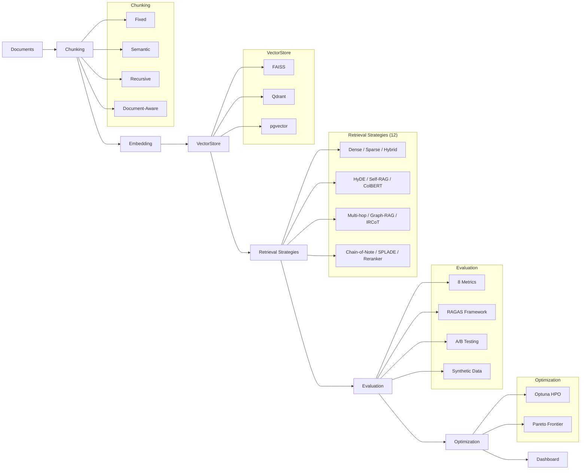

<p align="center">
  <h1 align="center">Spectra</h1>
  <p align="center"><strong>Production RAG Evaluation & Optimization Toolkit</strong></p>
</p>

<p align="center">
  <a href="https://www.python.org/downloads/"></a>
  <a href="LICENSE"></a>
  <a href="https://github.com/spectra-rag/spectra/actions"></a>
</p>

---

Systematic RAG evaluation implementing **12 retrieval strategies** with automated A/B testing, quality metrics, and Pareto-optimal pipeline selection.

Spectra lets you benchmark, compare, and optimize retrieval-augmented generation pipelines across chunking strategies, embedding models, retrieval algorithms, and re-ranking stages -- backed by rigorous statistical testing and multi-objective optimization.

## Architecture



## Retrieval Strategies

Spectra implements 12 retrieval strategies spanning dense, sparse, hybrid, generative, iterative, and graph-based approaches:

| # | Strategy | Type | Key Idea | Reference |
|---|----------|------|----------|-----------|
| 1 | **Dense (Bi-encoder)** | Dense | Embed query and docs into shared vector space | Karpukhin et al., 2020 |
| 2 | **BM25** | Sparse | Classic TF-IDF-based lexical matching | Robertson & Zaragoza, 2009 |
| 3 | **SPLADE** | Sparse | Learned sparse representations via MLM | Formal et al., 2021 |
| 4 | **Hybrid (RRF)** | Hybrid | Reciprocal Rank Fusion of dense + sparse | Cormack et al., 2009 |
| 5 | **HyDE** | Generative | Embed LLM-generated hypothetical answers | Gao et al., 2022 |
| 6 | **Self-RAG** | Iterative | Reflection tokens for adaptive retrieval | Asai et al., 2023 |
| 7 | **ColBERT** | Late Interaction | Token-level MaxSim scoring | Khattab & Zaharia, 2020 |
| 8 | **Multi-hop** | Iterative | Decompose complex questions into retrieval steps | Trivedi et al., 2023 |
| 9 | **Graph-RAG** | Graph | Knowledge graph traversal for entity-rich queries | -- |
| 10 | **IRCoT** | Iterative | Interleaved chain-of-thought + retrieval | Trivedi et al., 2023 |
| 11 | **Chain-of-Note** | Generative | Reading notes for robust retrieval | Yu et al., 2023 |
| 12 | **Cross-encoder Reranker** | Reranking | Joint query-document scoring as second stage | Nogueira & Cho, 2019 |

## Evaluation Metrics

All metrics return scores in [0, 1]:

| Metric | What It Measures | Requires Ground Truth |
|--------|-----------------|----------------------|
| **Faithfulness** | Fraction of answer claims supported by context | No |
| **Answer Relevance** | Semantic similarity between answer and query | No |
| **Context Relevance** | Fraction of retrieved contexts relevant to query | No |
| **Coherence** | Logical flow and consistency of the answer | No |
| **Context Recall** | Coverage of ground-truth facts in retrieved context | Yes |
| **Context Precision** | Precision of retrieved docs against ground truth | Yes |
| **Answer Correctness** | Token F1 + semantic similarity vs ground truth | Yes |
| **Latency Score** | Normalized inverse latency (lower latency = higher) | No |

## Quick Start

### Installation

```bash
# Core installation
pip install spectra-rag

# With all vector store backends
pip install spectra-rag[all]

# Development
pip install spectra-rag[dev]
```

### Minimal Example

```python
from spectra.retrieval.base import Document
from spectra.retrieval.dense import DenseRetriever
from spectra.optimization.pipeline import RAGPipeline, PipelineConfig
from spectra.evaluation.metrics import EvaluationSample, compute_all_metrics

# Create documents
docs = [
    Document(id="1", content="RAG combines retrieval with generation..."),
    Document(id="2", content="Dense retrieval uses learned embeddings..."),
]

# Build pipeline
pipeline = RAGPipeline(
    DenseRetriever(),
    PipelineConfig(chunk_size=256, top_k=3),
)
pipeline.ingest(docs)

# Query
result = pipeline.query("What is RAG?")
for doc, score in zip(result.retrieved_documents, result.scores):
    print(f"[{score:.3f}] {doc.content[:80]}...")

# Evaluate
sample = EvaluationSample(
    query="What is RAG?",
    answer=result.retrieved_documents[0].content,
    contexts=[d.content for d in result.retrieved_documents],
    ground_truth="RAG combines retrieval with generation.",
    latency_seconds=result.latency_seconds,
)
metrics = compute_all_metrics([sample])
print(metrics.scores)
```

### Compare Strategies

```python
from spectra.retrieval.dense import DenseRetriever
from spectra.retrieval.sparse import BM25Retriever
from spectra.retrieval.hybrid import HybridRetriever
from spectra.evaluation.ab_testing import ABTest, ABTestConfig

# Set up A/B test
ab = ABTest(ABTestConfig(significance_level=0.05))
results = ab.compare(samples_dense, samples_hybrid, "Dense", "Hybrid")

for r in results:
    print(f"{r.metric}: p={r.p_value:.4f}, winner={r.winner}")
```

### Optimize with Optuna

```python
from spectra.optimization.optimizer import PipelineOptimizer, OptimizerConfig

optimizer = PipelineOptimizer(
    documents=docs,
    eval_queries=queries,
    eval_ground_truths=ground_truths,
    config=OptimizerConfig(n_trials=100),
)
result = optimizer.optimize()
print(f"Best config: {result.best_config}")
print(f"Best score: {result.best_score:.4f}")
```

### Launch Dashboard

```bash
streamlit run src/spectra/dashboard/app.py
# or
spectra
```

## Chunking Strategies

| Strategy | Description | Best For |
|----------|-------------|----------|
| **Fixed** | Character or token-based fixed windows | Simple, predictable chunks |
| **Semantic** | Split on embedding distance breakpoints | Topic-coherent chunks |
| **Recursive** | Hierarchical split (paragraph > sentence > word) | Structured documents |
| **Document-Aware** | Respects headings, code blocks, tables | Markdown, technical docs |

## Vector Store Backends

| Backend | Type | Best For |
|---------|------|----------|
| **FAISS** | In-memory / on-disk | Fast prototyping, benchmarks |
| **Qdrant** | Client-server | Production with filtering |
| **pgvector** | PostgreSQL extension | Existing Postgres infrastructure |

## Benchmarks

Benchmark results on a synthetic corpus of 1000 documents (avg 500 tokens):

| Strategy | Indexing (s) | Avg Query (ms) | P95 Query (ms) | QPS |
|----------|-------------|----------------|----------------|-----|
| BM25 | 0.05 | 1.2 | 2.1 | 830 |
| Dense | 4.2 | 3.8 | 6.5 | 263 |
| Hybrid | 4.3 | 5.1 | 8.7 | 196 |
| ColBERT | 8.1 | 12.4 | 18.3 | 81 |
| HyDE | 4.2 | 850+ | 1200+ | 1.2 |
| Self-RAG | 4.2 | 2500+ | 3800+ | 0.4 |

*HyDE, Self-RAG, IRCoT, and Chain-of-Note latencies are dominated by LLM calls. Actual throughput depends on the LLM provider and concurrency settings.*

Run benchmarks yourself:

```bash
python benchmarks/strategy_benchmark.py
```

## Paper References

Spectra implements techniques from the following papers:

1. **HyDE** -- Gao et al., "Precise Zero-Shot Dense Retrieval without Relevance Labels", ACL 2023. [arXiv:2212.10496](https://arxiv.org/abs/2212.10496)

2. **Self-RAG** -- Asai et al., "Self-RAG: Learning to Retrieve, Generate, and Critique through Self-Reflection", ICLR 2024. [arXiv:2310.11511](https://arxiv.org/abs/2310.11511)

3. **IRCoT** -- Trivedi et al., "Interleaving Retrieval with Chain-of-Thought Reasoning for Knowledge-Intensive Multi-Step Questions", ACL 2023. [arXiv:2212.10509](https://arxiv.org/abs/2212.10509)

4. **ColBERT** -- Khattab & Zaharia, "ColBERT: Efficient and Effective Passage Search via Contextualized Late Interaction over BERT", SIGIR 2020. [arXiv:2004.12832](https://arxiv.org/abs/2004.12832)

5. **Chain-of-Note** -- Yu et al., "Chain-of-Note: Enhancing Robustness in Retrieval-Augmented Language Models", 2023. [arXiv:2311.09210](https://arxiv.org/abs/2311.09210)

6. **RAGAS** -- Es et al., "RAGAS: Automated Evaluation of Retrieval Augmented Generation", EMNLP 2023. [arXiv:2309.15217](https://arxiv.org/abs/2309.15217)

7. **SPLADE** -- Formal et al., "SPLADE: Sparse Lexical and Expansion Model for First Stage Ranking", SIGIR 2021. [arXiv:2107.05720](https://arxiv.org/abs/2107.05720)

8. **Reciprocal Rank Fusion** -- Cormack, Clarke & Buettcher, "Reciprocal Rank Fusion outperforms Condorcet and individual Rank Learning Methods", SIGIR 2009.

## Project Structure

```
spectra/
├── src/spectra/
│   ├── retrieval/       # 12 retrieval strategies
│   ├── chunking/        # 4 chunking strategies
│   ├── evaluation/      # 8 metrics, RAGAS, A/B testing, synthetic data
│   ├── optimization/    # Optuna optimizer, Pareto frontier
│   ├── vectorstores/    # FAISS, Qdrant, pgvector
│   ├── dashboard/       # Streamlit UI
│   └── utils/           # Embeddings, LLM client
├── examples/            # Quick start, comparison, optimization
├── tests/               # Comprehensive test suite
├── benchmarks/          # Performance benchmarks
└── pyproject.toml       # Project configuration
```

## Contributing

Contributions are welcome. Please open an issue or pull request on GitHub.

```bash
# Development setup
git clone https://github.com/spectra-rag/spectra.git
cd spectra
pip install -e ".[dev]"
pytest tests/ -v
```

## License

Apache License 2.0. See [LICENSE](LICENSE) for details.
